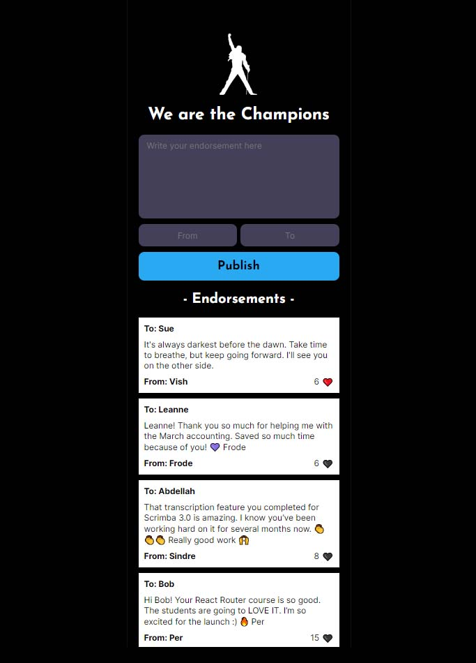

# We Are The Champions

This is the solo project for the Pro version of Scrimba's [Build A Mobile App With Firebase](https://scrimba.com/learn/firebase) course. It was also incorporated into the [Frontend Developer Path](https://scrimba.com/learn/frontend) into the end of Module 3: Making Websites Interactive. The goal is to build it from scratch using the design from a Figma file as a reference. It makes use of a __Firebase Realtime Database__ to store information and update in realtime as changes are made.

I built out the app as presented in the Figma design and then moved on to the stretch goals. The following functionality was added:

- Add __From__ input field
- Add __To__ input field
- Reverse the order of the entries
- Add likes

My implementation of the "likes" feature differs from previous implementations at Scrimba. In previous Scrimba projects, "likes" and other data were stored in `localStorage`, on the user's browser. I didn't want the number of likes to be local. I wanted it to be global, for all users, regardless of where they accessed the app from. To solve this, I did two things:

- I added a unique user ID, which is local to the visitor/browser
- This ID is added to a "likedBy" array in the Firebase database for the given endorsement

This approach lets visitors like/unlike endorsements and tracks them in the cloud using Firebase, so "likes" are not just local to the computer and behave like they would for other cloud-enabled applications.

Deployed at: https://vish213-champions.netlify.app/

## JavaScript concepts

- module imports & exports
- objects
- variables
- document
    - .getElementById()
- functions
    - event listeners
    - event handlers
- localStorage
    - .setItem()
    - .getItem()
- element
    - .addEventListener()
        - click
    - .target
        - .className
        - .dataset
    - .value
    - .innerHTML
- arrays
    - .find()
    - indexOf()
    - .splice()
    - .push()
    - .reverse()
    - .forEach()
- promises
    - .catch()
- string template literals
- Object.entries

## Firebase concepts

- initializeApp
- getDatabase
- ref
- push
- onValue
- update
- off
- snapshot
    - .exists()
    - .val()